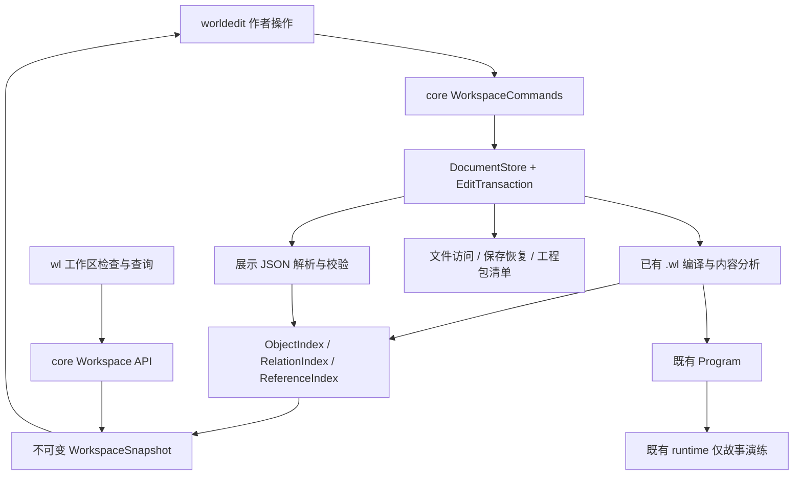

# worldline 系统架构设计

版本0.2，待评审（0.2修订：M1矢量画布与地图自有坐标系）；基线`dcb6479873f86b08354ba92b098dc260aa976624`。新增类型/接口/语法均为提案。共同数据格式以[共同契约](../../spec/presentation.md)及`../../spec/schemas/`为准，本文不另定义一套冲突字段。

## 1. 架构目标

以当前core为中心，支持作者内容与其展示配置的统一工程生命周期。core不依赖egui，不解码图片，不启动世界演化；runtime继续只处理既有故事演练。

关键质量属性：稳定引用、内容/版式隔离、离线可用、修改可撤销、失败可恢复、旧工程可读、跨平台格式一致。需求覆盖WL-001–029及共同Q项；产品目标见[PRD](PRD.md)。

## 2. 当前结构与改造边界

| 当前部分 | 已读到的结构 | 改造方式 |
|---|---|---|
| compiler | 目录/单源/内存覆盖最终进入同一解析分析流程 | 保留；增加显式CompileOptions，不把地图JSON塞进词法器 |
| Project | documents为.wl文档，saved为基线 | 新增展示文档及统一DocumentStore门面；原sources()仍仅返源码 |
| authoring | Project::edit复制候选并编译，通过才提交 | 保留旧入口；新命令区分内容验证与版式验证 |
| Catalog | TargetRef(kind,id)、对象列表、别名、引用 | 增量派生身份及反向索引，兼容旧JSON输出 |
| RelationGraph | event/scene和执行边 | 不复用为知识网络，保留原契约 |
| runtime | Program+故事会话 | 新地图不进入Program/StoryState，依赖方向不反转 |
| CLI/agent | 原检查、目录、图、试玩与stdio会话 | CLI附加工作区/地图/关系查询；不要求agent写UI缓冲 |

依据：[R04–R06,R10,R13–R18](shared/RESEARCH.md)。

## 3. 组件结构



地图和网络从WorkspaceSnapshot读取，不从RUN读取。Runtime不调用地图、模板或布局模块。不存在sim组件。

## 4. 模块划分与文件落点

以下新路径是建议，不意味着基线已有这些文件。

| 路径 | 职责 | 阶段 |
|---|---|---|
| `core/src/project.rs` | 扩展工程会话，统一dirty/refresh/restore/打包 | M1 |
| `core/src/workspace_documents.rs`（新） | 文档分类、基线、新增/删除墓碑、版本能力 | M1 |
| `core/src/presentation/mod.rs`（新） | 地图/视图DTO与展示分析入口 | M1 |
| `core/src/presentation/maps.rs`（新） | 图层、标记、导航、几何验证 | M1/M4 |
| `core/src/workspace_commands.rs`（新） | 内容/版式命令、预检、变更摘要 | M1 |
| `core/src/workspace_snapshot.rs`（新） | 工作区快照及修订分域 | M1 |
| `core/src/reference_index.rs`（新） | 对象、地图、正文和关系的反查 | M1/M2 |
| `core/src/save_transaction.rs`（新） | 保存日志、逐文件提交和恢复 | M1 |
| `core/src/entities.rs`（新） | 新实体和模板适用类型 | M2 |
| `core/src/semantic_relations.rs`（新） | 关系类型、实例、兼容人物关系 | M2 |
| `core/src/knowledge_graph.rs`（新） | 局部邻接查询，不负责显示布局 | M2 |
| `core/src/templates.rs`（新） | 模板读取/合并/安全校验 | M3 |
| `core/src/collaboration.rs`（新） | 批注锚定、提案、三方语义差异 | M4 |
| `core/src/ast.rs`,`lexer.rs`,`parser.rs`,`analysis.rs` | 1.10受控语法扩展 | M2/M3 |
| `core/src/catalog.rs`,`navigation.rs`,`wiki.rs` | 新对象参与索引和正文引用 | M2/M3 |
| `cli/src/lib.rs` | 新查询命令与JSON输出 | M2 |
| `spec/` | 新的展示/关系/模板契约与旧规范更新 | 各阶段同PR |

建议先在同一core crate内新增模块，不立即拆多个库。只有构建时间或API边界有实测问题，再拆纯数据子crate。

## 5. 数据源和缓存

### 5.1 唯一真源

`.wl`为世界内容和语义关系；`.world/maps/*.json`为地图版式；`.world/graph_views/*.json`为网络专题配置；模板/讨论各有用途。数据库与内存索引只作为派生视图，不反向覆盖正文。

暂时保留`Project.documents`以降低旧代码迁移量，增加`authoring_documents`并以统一接口遍历。禁止让UI持有第二套可写map文件；更不能由UI跳过Project调用std::fs::write。

### 5.2 快照和修订

WorkspaceSnapshot包含原CompileResult的共享引用、ObjectIndex、RelationIndex、MapIndex、反向引用和分域诊断。修订至少区分workspace/content/presentation三种generation。

content变化重新解析受影响内容并更新内容快照；presentation变化只重解析地图/布局与引用，复用原CompileResult。M1允许小规模全量重建地图索引，但不能每一帧或每次pointer_move重编译源码。缓存不写回为作者设定。

原有指纹不是工作区修订号。它继续决定既有存档兼容；地图有变化不等于故事版本有变化。[R13]

### 5.3 索引

```text
ObjectIndex: TargetRef -> ObjectSummary + SourceLocation
RelationById: RelationId -> SemanticRelation
Outgoing: TargetRef -> ordered RelationIds
Incoming: TargetRef -> ordered RelationIds
PlacementsByTarget: TargetRef -> (MapId,PlacementId)[]
ReferencesByTarget: TargetRef -> ClassifiedReference[]
```

构建时进行去重但不删除合法重复标记或多关系。查询最大深度和结果上限是防止UI爆炸的边界；原始数据完整保留。暂不增加图数据库、全文索引服务或分布式缓存。

## 6. 创建地图的事务

1. 读取当前快照和expected_revision。
2. 选择已存在的asset或通过显式导入将文件加入staged_assets；只存工作区内路径。
3. 在候选DocumentStore中新增/更新清单与MapDocument；如果显式导入新素材，同时经现有asset创作API建立唯一asset声明，不能只有二进制文件却引用一个不存在的asset ID。
4. 验证地图ID、注册路径、图层、几何及对象/asset引用。
5. 生成ChangeSet，提交到内存，写一条Undo；不直接保存磁盘。
6. 仅引用已有asset时更新presentation_generation及地图索引；如果用户同时显式导入新素材并建立asset声明，该组合命令也更新content_generation，但沿用asset元数据不改变运行指纹的规则。移动既有标记不进行素材导入。
7. 用户保存时统一处理源码、JSON和staged_assets。

撤销创建地图不能删除本来就存在的栅格图层素材；新导入且未被其他对象引用的素材，可以只撤销此次新增的资源记录，最终落盘删除仍按显式规则处理。读asset优先访问staged bytes，否则访问安全文件系统。

## 7. 编辑事务与草稿支持

新增接口提案：

```rust
// 接口示意；不是可直接针对0.2.0编译的代码。
fn snapshot(&self) -> Arc<WorkspaceSnapshot>;
fn preview(&self, envelope: &CommandEnvelope) -> Result<ChangePreview, EditError>;
fn apply(&mut self, envelope: CommandEnvelope) -> Result<ChangeSet, EditError>;
fn plan_delete(&self, target: TargetRef) -> DeletePlan;
fn save_workspace(&mut self) -> Result<SaveReport, SaveError>;
```

旧Project::edit继续维持“内容结构修改后不能有编译错误”的已有语义。展示事务不通过它的全局编译门槛；改某个标记坐标只检查该文档和操作影响，不能被另一个章节未写完锁死。建立新对象引用时必须确认身份存在；来源解析失败是unresolved，不自动当missing。

原始文本模式可以存未完成的文档，但StructuredCommand必须保证自身不产生新增结构错误。差异校验不能简单比较错误条数：同样数量的错误可能完全不同。使用明确受影响对象与诊断身份比较，并保留其余既有错误。

Undo遵循同一命令粒度。M1可复用Vec<Project>思路但新文档也纳入；图片数据用Arc或文件/内容hash共享。超过测试预算后再切换持久化映射/文档patch历史，不同时重写全部文本编辑系统。[R07]

## 8. 保存和恢复的工程约束

当前实现全量预检后逐文件临时替换，且每完成一文件推进其保存基线；它不是跨文件原子事务。[R04] 本方案增加恢复日志，区分“内存原子应用”和“可恢复的磁盘批量保存”。

每次保存建立txid，记录前/后hash和所有目标。预写临时文件并flush；记录prepared；逐文件替换记录进度；完成后标committed，再统一推进会话保存基线并清理日志。目录同步能力依平台验证，不用跨平台绝对持久保证替代测试。

启动遇未完成事务，检测目标当前hash：与后镜像相同表示已写，与前镜像相同表示待写，两者都不同说明外部修改，停止自动恢复并保留双方。不以日志为理由覆盖第三方稿。

新暂存路径保留区必须写入workspace规范，打包前检查未完成事务。外部变化检测覆盖清单和JSON；删除文件用墓碑保留原基线，避免refresh后重新出现。移文件/改ID属于跨文档命令，也受同样保护。

## 9. 语言1.10的最小扩展

M1不改语言。M2在明确语言版本下添加entity、relation_type和relation_def顶层声明，内部复用已有字符串/数值/布尔属性和description；语法例子见共同契约。

新实体使用固定kind=entity和独立entity_type，避免每增加一个模板就修改所有TargetKind判断。类关系不变成对象继承求值或规则执行。复杂关系通过独立条目加参与者角色表示。

新增kind必须同时接入catalog对象、别名、mark/attach、正文显式链接、Wiki、删除重命名及诊断。不允许只在实体表单里可见而其他视图查不到。

新关键字不能无版本地夺取旧正文。旧compile_source默认1.9，新入口编译选项声明1.10，清单决定工程模式。实体/新语义关系不参与执行Program和存档指纹，旧character/world等原有字段的指纹行为仍保留；须建立回归测试证明，而非仅注释说明。

### 9.1 不强制转换tag

M1可将现有tag词条挂到地图。M2可创建真正的地点/组织entity。老工程的tag不要批量猜测改型；显式迁移时一次更新引用和分类，保留身份重定向报告。未迁移内容继续可用，不制造两个同名实体真源。

## 10. 内容、历史、来源与模板

历史事件采用entity_type=historical_event等资料类型，scene是对它的描写，通过depicts之类作者关系关联。无需修改所有旧event才能开始记录世界历史。

模板定义fields、prompts、suggested_relations和展示顺序，实例值仍写.wl。模板删除/更新仅改变表单推荐，不删除未知值。首版自由多行文本沿用字符串转义存储，复杂富文本/CST改造不作为地图前置。

来源、陈述性质和创作状态在新内容模型中保存为非执行元数据；具体语法须与1.10规范同PR定稿，不由UI私有JSON保存另一份事实。旧类型暂使用可选资料字段/独立关系提供等价记录，之后显式迁移。

## 11. 批注和文件协作

M4新增CommentDocument，锚定类型：Object、Relation、Placement、SourceRange。SourceRange含文档基线、前后短片段与原范围；重定位失败可读但失锚，不能仅按旧行号绑定。

ProposalDocument保存base hashes、作者声明、理由、命令和预览。通过现有CommandEngine采纳；基线不符返回需重审。已接受提案要记录实际结果修订，不能只改状态文字而没应用内容。

地图字典以稳定ID作为合并单位；layer_order等数组并发重排显示冲突。没有服务端签名/认证，本地署名不具强安全效力；不把角色的叙事perm用作编辑权限。

## 12. CLI、版本和发布

旧协议与命令保持，新增workspace检查和maps/relations查询；新JSON输出独立schema版本和能力列表。原wl graph不能悄悄切换为世界关系图。

保留同级path依赖，但CI为worldedit读取并固定worldline兼容提交。源码新API、编辑器消费、文档格式与测试成对发布；不把“Cargo.lock存在”等同于旁边仓库源码被锁定。[R03,R12,E07]

原有导出是工程保存/交换；移除其无事件限制，不新增世界书或外部发布器。纯内容能力与可运行能力在WorkspaceSnapshot分别呈现。

## 13. 安全和资源边界

引用路径经现有安全文件访问层，拒绝越界、符号链接逃逸和包中重复路径。对Windows大小写、Unicode归一化造成的路径碰撞进行移植性检查，但不静默改作者文件名。注册表只接受预期目录/类型，未知普通JSON不执行。

core不解码图片；UI进行尺寸/像素/并发预算检查。模板没有代码求值，地图和批注不运行HTML脚本或远程资源。M1沿用浏览器包4096文件/64MiB限制，修改限制必须独立资源评审。[R09]

## 14. 测试映射与开放工程验证

新增core集成测试建议：presentation_roundtrip、workspace_transactions、map_references、authoring_only_project、semantic_relations、rename_across_documents、legacy_compatibility、recovery_faults。每条WL需求对应T-WL编号；集成测试见[TEST_PLAN](shared/TEST_PLAN.md)。

须实际验证的高风险点：现有存档指纹与新增声明隔离；Project旧公开字段和新会话兼容；Windows替换失败恢复；WASM虚拟文件层与未保存asset；旧关键词处理。未完成验证时不能按架构图宣称系统已经支持。
